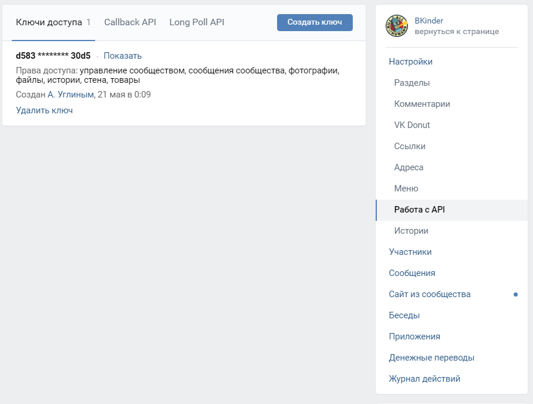
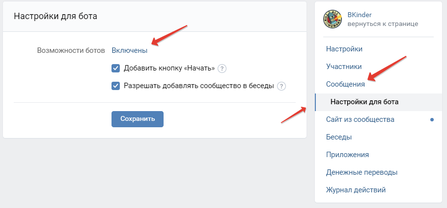
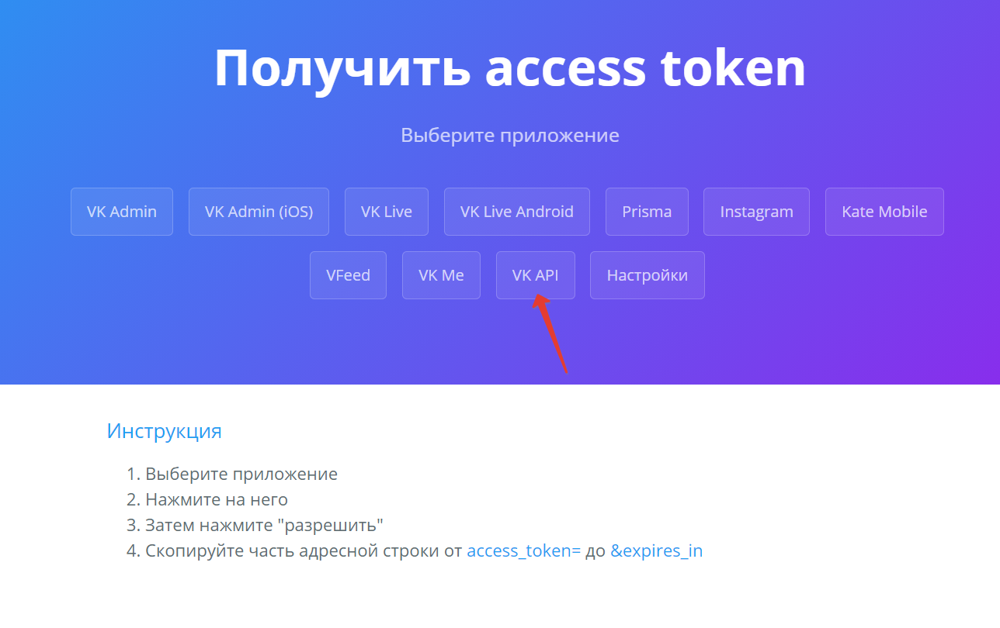
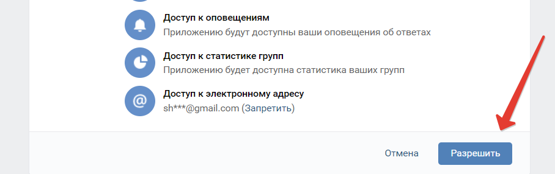
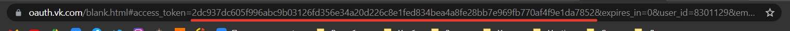

## ВАЖНО
1. Для корректной работы необходимо файл .env_ переименовать в .env
2. Заполнить значения переменных в файле .env согласно их названию

## Как настроить группу для бота и получить токен
### Для создания токена для бота нужно

1. Создать группу в VK
2. Зайти в Управление -> Работа с API. Создать ключ.

3. Включить возможность писать сообщения в группу. Управление -> Сообщения -> Сообщения сообщества: включить.
4. Настройки бота. Возможности бота: Включены (в случае если эта настройка отключена в логах будет ошибка 
"[912] This is a chat bot feature, change this status in settings")

## Как получить токен пользователя
1. Перейти по ссылке https://vkhost.github.io/
2. Выбрать VK API

3. На следующей странице дать разрешения

4. На следующей странице из адресной строки сткопировать токен 

#### бот в стадии разработки, абсолютно все может изменится

#### документация будет как только закончится разработка
