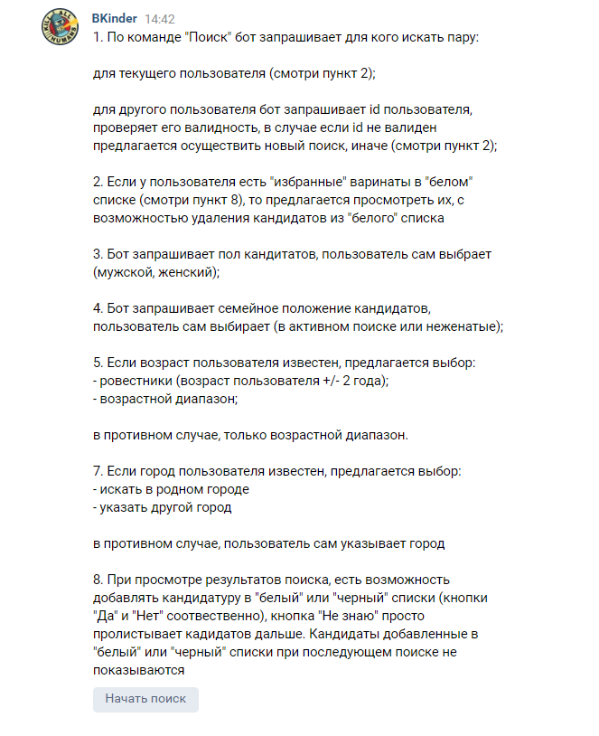
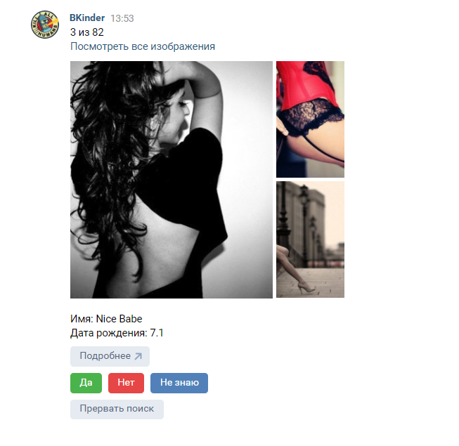
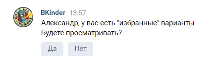
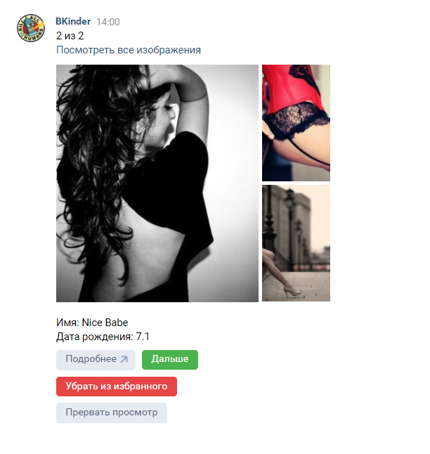

## Перед запуском бота
1. Для установки зависимостей выполнить команду `pip install -r requirements.txt`
2. Для корректной работы необходимо файл .env_ переименовать в .env
3. Заполнить значения переменных в файле .env согласно их названию (**смотри пункт 4**)
4. [Как настроить группу для бота и получить требуемые значения для настройки приложения](documentation/get_and_set_values.MD)

## Запуск бота
1. Для запуска проекта выполнить команду `python main.py`
2. Если бот не запускается проверить логи (папка 'logs')

## Бот запущен
1. Для начала диалога с ботом отправить ему сообщение **Начать**    

2. Подробности работы бота можно узнать послав ему сообщение **Инфо**  

## Описание
ВК-чат-бот для знакомств  
Бот, основываясь на данных пользователя и заданных в диалоге параметрах, ищет подходящих кандидатов.  
В процессе просмотра полученных результатов существует возможность добавлять кандидатов в "белый" и "черный"
списки (кнопки "Да" и "Нет" соотвественно)  
Кнопка "Не знаю" просто пролистывает дальше  
   

Кандидаты добавленные в один из списков не будут показанны при следующем поиске  

Есть возможность просмотреть "белый" список  
    

При просмотре "белого" списка дана возможность исключать из него кандидатов  
  
